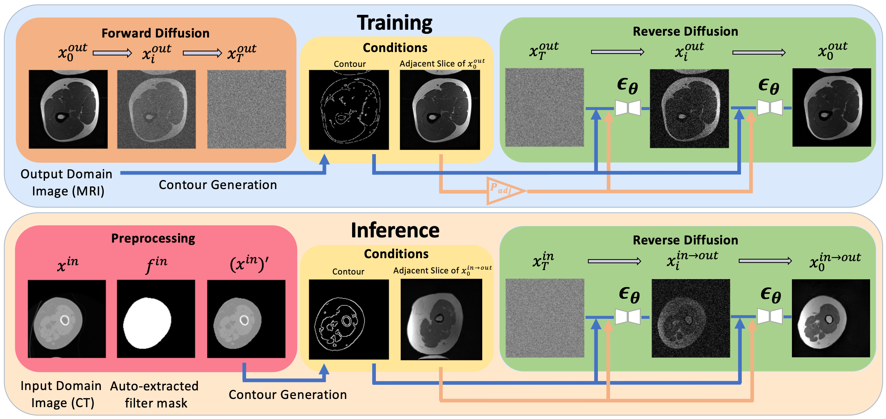
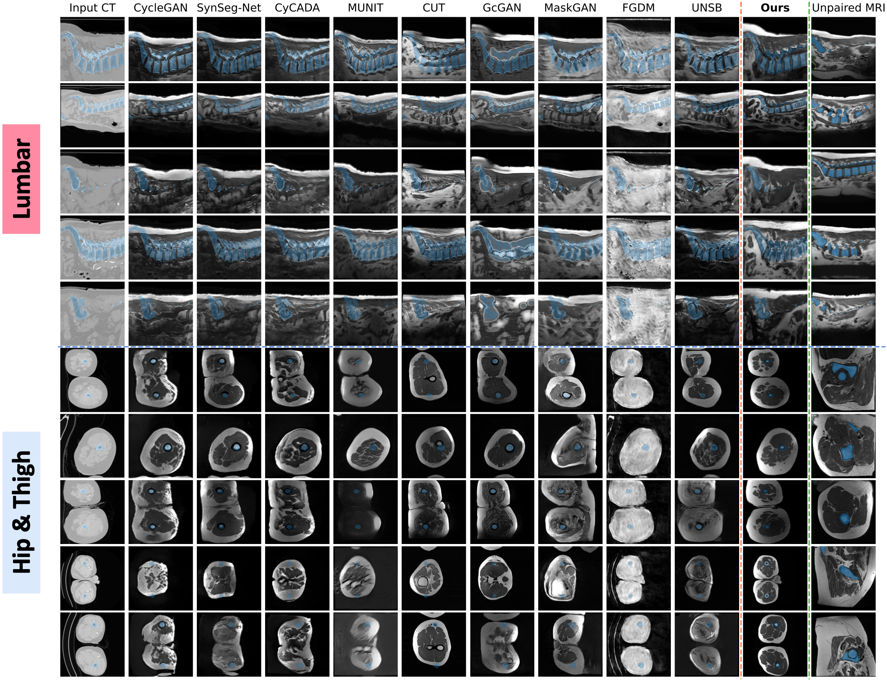

# ContourDiff
Contour-Guided Diffusion Models for Unpaired Image-to-Image Translation

[](https://arxiv.org/abs/2403.10786)

#### By [Yuwen Chen](https://scholar.google.com/citations?user=61s49p0AAAAJ&hl=en), [Nicholas Konz](https://nickk124.github.io/), [Hanxue Gu](https://scholar.google.com/citations?user=aGjCpQUAAAAJ&hl=en), [Haoyu Dong](https://scholar.google.com/citations?user=eZVEUCIAAAAJ&hl=en), [Yaqian Chen](https://scholar.google.com/citations?user=iegKFuQAAAAJ&hl=en), [Lin Li](https://orcid.org/0009-0009-5433-6777), [Jisoo Lee](https://scholar.google.com/citations?user=6klcF3MAAAAJ) and [Maciej Mazurowski](https://sites.duke.edu/mazurowski/)




This is the code for our paper [**ContourDiff: Unpaired Medical Image Translation with Structural Consistency**](https://arxiv.org/abs/2403.10786), which is a novel framework that leverages domain-invariant anatomical contour representations of images to enable unpaired translation between different domains.

### Why use our model?
Our method can:
1. Enforce precise anatomical consistency even between modelaities with severe structural biases (See example figure below)
2. Potentially translate images from arbitrary unseen input domains (i.e., train once, translate any)



Great thanks to [Segmentation-guided Diffusion](https://github.com/mazurowski-lab/segmentation-guided-diffusion/tree/main) for inspiration and code backbone!

## Citation

Please cite our paper if you use our code or reference our work:
```bib
@article{chen2024contourdiff,
  title={ContourDiff: Unpaired Image Translation with Contour-Guided Diffusion Models},
  author={Chen, Yuwen and Konz, Nicholas and Gu, Hanxue and Dong, Haoyu and Chen, Yaqian and Li, Lin and Lee, Jisoo and Mazurowski, Maciej A},
  journal={arXiv preprint arXiv:2403.10786},
  year={2024}
}
```

## Getting Started
Please follow the steps below to have your own ContourDiff model!

## 1) Preprocess data and extract contours
To extract the contours, run command:
```bash
python preprocess.py \
  --data_directory {DATA_DIRECTORY} \
  --domain_img_folder {DOMAIN_IMG_FOLDER} \
  --domain_contour_folder {DOMAIN_CONTOUR_FOLDER} \
  --domain_meta_path {DOMAIN_META_PATH} \
```
where:
- `DATA_DIRECTORY` is directory of data from multiple domains
- `DOMAIN_IMG_FOLDER` is path to certain domain images under `DATA_DIRECTORY`
- `DOMAIN_CONTOUR_FOLDER` is path to save extracted contours under `DATA_DIRECTORY`
- `DOMAIN_META_PATH` is path (*.csv) to save meta information under `DATA_DIRECTORY`

To enable removal of non-anatomical background artifacts, use `--remove_artifact`.

For example, given data structure below:

``` 
DATA_DIRECTORY
├── domain_1
│   ├── images
│   │   ├── img_1.png
│   │   ├── img_2.png
│   │   └── ...
├── domain_2
│   ├── images
│   │   ├── img_1.png
│   │   ├── img_2.png
│   │   └── ...
└── ...

```

If extracting contours for images from domain 1, then set `DOMAIN_IMG_FOLDER="domain_1/images"`
Then, if setting `DOMAIN_CONTOUR_FOLDER="domain_1/contours"` and `DATA_DIRECTORY="domain_1/df_meta.csv"`, the outcome data structure is:

``` 
DATA_DIRECTORY
├── domain_1
│   ├── images
│   │   ├── img_1.png
│   │   ├── img_2.png
│   │   └── ...
│   ├── contours
│   │   ├── img_1.png
│   │   ├── img_2.png
│   │   └── ...
│   ├── df_meta.csv
├── domain_2
│   ├── images
│   │   ├── img_1.png
│   │   ├── img_2.png
│   │   └── ...
└── ...

```
To visualize the extracted contours, run `contour_checker.ipynb`.

## 2) Training Phase
To train your own ContourDiff model, run command:
```bash
CUDA_VISIBLE_DEVICES=0,1,2 python3 train.py \
  --input_domain {INPUT_DOMAIN} \
  --output_domain {OUTPUT_DOMAIN} \
  --data_directory {DATA_DIRECTORY} \
  --input_domain_img_folder {INPUT_DOMAIN_IMG_FOLDER} \
  --input_domain_contour_folder {INPUT_DOMAIN_CONTOUR_FOLDER} \
  --output_domain_img_folder {OUTPUT_DOMAIN_IMG_FOLDER} \
  --output_domain_contour_folder {OUTPUT_DOMAIN_CONTOUR_FOLDER} \
  --input_domain_meta_path {INPUT_DOMAIN_META_PATH} \
  --output_domain_meta_path {OUTPUT_DOMAIN_META_PATH} \
  --output_dir {OUTPUT_DIR}
  --contour_guided \

```
where:
- `INPUT_DOMAIN` is the string name of the input domain (e.g. any, CT or MRI)
- `OUTPUT_DOMAIN` is the string name of the output domain (e.g. CT or MRI)
- `DATA_DIRECTORY` is directory of data from multiple domains
- `INPUT_DOMAIN_IMG_FOLDER` is path to input domain images under `DATA_DIRECTORY`
- `INPUT_DOMAIN_CONTOUR_FOLDER` is path to input domain contours under `DATA_DIRECTORY`
- `OUTPUT_DOMAIN_IMG_FOLDER` is path to output domain images under `DATA_DIRECTORY`
- `OUTPUT_DOMAIN_CONTOUR_FOLDER` is path to output domain contours under `DATA_DIRECTORY`
- `INPUT_DOMAIN_META_PATH` is path (*.csv) to input domain meta file under `DATA_DIRECTORY`
- `OUTPUT_DOMAIN_META_PATH` is path (*.csv) to output domain meta file under `DATA_DIRECTORY`
- `OUTPUT_DIR` is absolute path to save output results, including model checkpoints and visualization samples
- `contour_guided` is flag to enable contour-guided mode for diffusion models

Notice:
Input domain images and contours are used for validation in the training phase.

## 3) Translation Phase
To translate input domain images using your own ContourDiff model, run command:
```bash
python translation.py \
  --input_domain {INPUT_DOMAIN} \
  --output_domain {OUTPUT_DOMAIN} \
  --data_directory {DATA_DIRECTORY} \
  --input_domain_contour_folder {INPUT_DOMAIN_CONTOUR_FOLDER} \
  --input_domain_meta_path {INPUT_DOMAIN_META_PATH} \
  --num_copy {NUM_COPY} \
  --by_volume \
  --volume_specifier {VOLUME_SPECIFIER} \
  --slice_specifier {SLICE_SPECIFIER} \
  --selected_epoch {SELECTED_EPOCH} \
  --translating_folder_name {TRANSLATING_FOLDER_NAME} \
  --device {DEVICE} \
  --num_partition {NUM_PARTITION} \
  --partition {PARTITION}

```
where:
- `INPUT_DOMAIN` is the string name of the input domain (e.g. any, CT or MRI)
- `OUTPUT_DOMAIN` is the string name of the output domain (e.g. CT or MRI)
- `DATA_DIRECTORY` is directory of data from multiple domains
- `INPUT_DOMAIN_CONTOUR_FOLDER` is path to input domain contours under `DATA_DIRECTORY`
- `INPUT_DOMAIN_META_PATH` is path (*.csv) to input domain meta file under `DATA_DIRECTORY`
- `OUTPUT_DIR` is absolute path to save output results, including model checkpoints and visualization samples
- `NUM_COPY` is the number of samples generated in each iteration
- `by_volume` is flag to enable slice-by-slice generation within each volume
- `VOLUME_SPECIFIER` is string of column to indicate each volume (e.g., "volume")
- `SLICE_SPECIFIER` is string of column to indicate slice number (e.g., "slice")
- `SELECTED_EPOCH` is epoch of the selected checkpoint to load
- `TRANSLATING_FOLDER_NAME` is absolute path to store the tranlsated images
- `DEVICE` is GPU device
- `NUM_PARTITION` is total number of partition to split input domain units (either slices or volumes)
- `PARTITION` is specified partition to translate

Notice:
1. `VOLUME_SPECIFIER` and `SLICE_SPECIFIER` are required to enable `by_volume` translation, which means the meta file should include corresponding columns.
2. `NUM_PARTITION` and `PARTITION` are aimed for translation in parallel.
3. `PARTITION` is within range [0, `NUM_PARTITION` - 1].

## License
All codes in this repository are under [Apache 2.0](./LICENSE).
